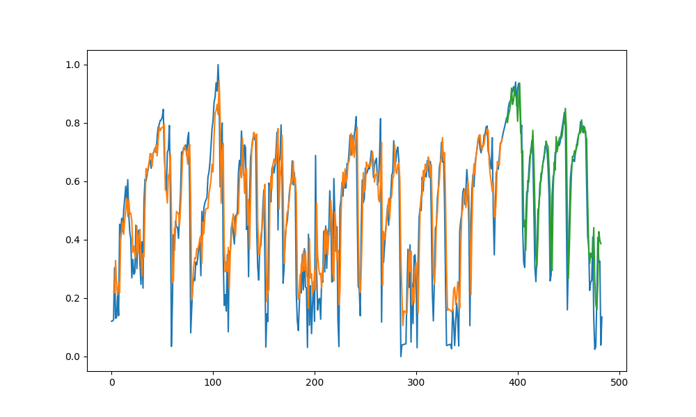

# Energy Prediction with CNN, LSTM

This is a project to predict some properties of the solar power system like the
remaining useful lifecycle, power created, etc.

## Train file

The train.inpynb is for a dataset with three years data with one minute interval

train_db and train_db1 is for a dataset with one and a half year data with one day interval

## Structure

All the saved models with some evaluation are in the Model, Model2, Model3 folders

## Example

Prediction of life cycle for the three year datasets

Prediction of life cycle for the one and half year datasets

